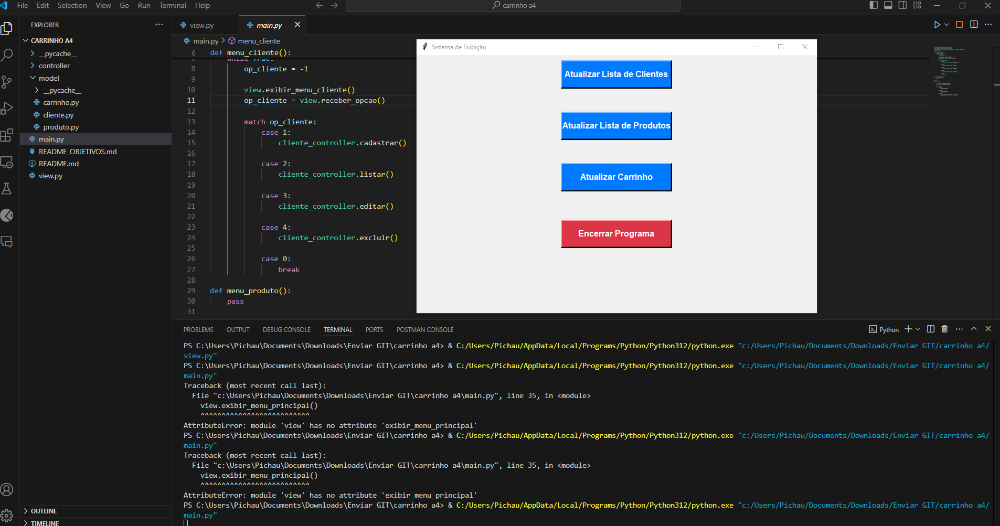

# 🚀 Sobre Mim

## 👋 Olá! Sou Xavier

Sou um estudante de **Desenvolvimento de Sistemas**. Estou em constante busca de novos desafios e oportunidades para aprimorar minhas habilidades.
Meu objetivo é aprender e crescer, aplicando soluções inovadoras em projetos diversos.

---

### 💡 Minhas Habilidades

- **Linguagens de Programação**: Python, JavaScript
- **Ferramentas e Tecnologias**: Git, VSCode

---

### 📁 Projetos em Destaque

#### **Carrinho de Compras**

Um projeto criado para gerenciar um carrinho de compras em um sistema web. Este projeto oferece uma interface intuitiva para gerenciar produtos e exibir o total do carrinho.

**Principais Funcionalidades:**
- Adiciona e remove produtos do carrinho
- Mostra a lista de produtos e o total acumulado

🔗 [Veja o Projeto no GitHub](https://github.com/Xavier-sa/projetocarrinho)

---

### 🌐 Conecte-se Comigo

- **LinkedIn**: [wellington-xavier](https://www.linkedin.com/in/wellington-xavier-90a004300/)
- **GitHub**: [Xavier-sa](https://github.com/Xavier-sa)

---

### 📚 Sobre Este Repositório

Este repositório contém o projeto **Carrinho de Compras**, desenvolvido para facilitar a gestão de carrinhos de compras em um sistema web. Explore o código, contribua com melhorias ou abra uma issue se encontrar algo que possa ser aprimorado. 

Obrigado por visitar meu perfil! Estou aberto a sugestões e feedback para aprimorar meus projetos e habilidades.

---

*Atualizado em 09/08/2024*  
*w.xavier*
